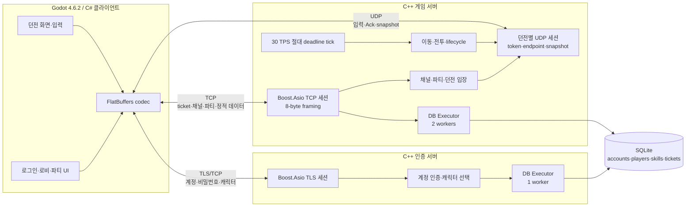
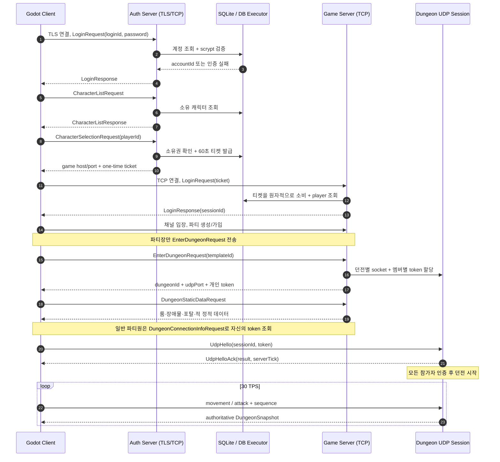
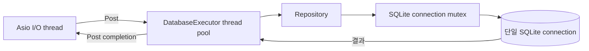

# DNF Mock Server + Client

**TLS 인증과 일회성 티켓, TCP 로비, UDP 30Hz 서버 권위형 던전 시뮬레이션을 구현한 C++20·Godot 온라인 액션 게임 서버 포트폴리오입니다.**

상점이나 아이템 파밍처럼 서버의 핵심 구조와 거리가 있는 기능보다, 사용자의 입력을 구분하고 검증하여 1~4인 파티가 독립된 던전 UDP 세션에서 플레이하는 수직 단면에 집중했습니다.

## 10초 요약

- C++20, Boost.Asio, OpenSSL, FlatBuffers, SQLite로 인증 서버와 게임 서버를 구현했습니다.
- 비밀번호는 TLS 인증 서버에서만 다루고, 게임 서버에는 60초 수명의 일회성 티켓으로 접속합니다.
- 채널·4인 파티·던전 입장은 신뢰성 있는 TCP로, 이동·공격·상태 snapshot은 UDP로 분리했습니다.
- 던전은 30 TPS로 동작하며 좌표, 충돌, 포탈, MP, 쿨타임, 스킬 단계, 히트박스와 데미지를 서버가 판정합니다.
- Godot 4.6.2 C# 클라이언트로 로그인부터 1인/4인 던전까지 직접 시연할 수 있습니다.
- CTest 58개와 C# smoke test를 제공하며, CI에서 Linux GCC/Clang, macOS, Windows MSVC와 sanitizer를 검사합니다.

## 구현 범위

| 영역 | 구현 내용 |
| --- | --- |
| 인증 | TLS 1.2 이상, 계정 로그인, scrypt 비밀번호 검증, 캐릭터 목록과 선택 |
| 접속 전환 | 32바이트 난수 기반의 60초 일회성 티켓, 계정·캐릭터 소유권 검증, 게임 Session ID 발급 |
| TCP 로비 | 채널 목록과 정원, 채널 입장, 4인 파티 생성·가입·탈퇴·snapshot |
| 던전 입장 | 파티장 생성 요청, 파티원별 UDP token, 접속 정보 조회, 던전 카탈로그와 정적 룸 데이터 |
| UDP 세션 | `UdpHello` 인증과 Ack, endpoint 등록, heartbeat, idle timeout, wrap-safe sequence 검증 |
| 이동 | 방향 입력 정규화, 서버 이동 속도 적용, 룸 경계·장애물·포탈 판정 |
| 전투 | MP, HP, 쿨타임, Startup/Active/Recovery, 방향성 히트박스, 데미지와 적 사망 판정 |
| 상태 동기화 | 최대 1200바이트 datagram, 30Hz snapshot, 오래된 snapshot 거부, latest-wins 전송 대기열 |
| 콘텐츠 | Forest 던전 2개 룸, 포탈, 장애물, Goblin, Ice Slash 예제 |
| 클라이언트 | Godot C# 로그인·캐릭터 선택·채널·파티·던전 UI와 간단한 횡스크롤 전투 화면 |
| 데이터 | SQLite schema migration, 계정·캐릭터·스킬·일회성 티켓 repository |

프로젝트는 완성된 상용 게임이 아니라 **온라인 액션 게임 서버의 핵심 연결 경로를 검증하는 포트폴리오**입니다. 현재 콘텐츠는 서버 시작 시 C++ 코드로 적재하는 작은 예제 데이터입니다.

## 전체 아키텍처



인증 서버와 게임 서버는 별도 실행 파일입니다. 두 프로세스는 같은 SQLite 파일을 통해 일회성 티켓을 발급하고 소비합니다. 게임 서버 안에서는 네트워크 I/O, 던전 tick, DB 작업의 실행 위치를 분리하고 세션별 `strand`로 비동기 콜백 순서를 보장합니다.

## 인증 → 게임 TCP → 던전 UDP



`Session ID`는 현재 TCP 연결을 식별하고, `Player ID`는 DB에 저장되는 캐릭터를 식별합니다. 재접속을 추가할 때는 수명이 짧은 Session ID가 아니라 Account/Player ID를 기준으로 복원해야 합니다.

## TCP와 UDP를 분리한 이유

| 구간 | 전송 | 선택 이유 |
| --- | --- | --- |
| 계정 인증 | TLS/TCP | 비밀번호와 캐릭터 선택은 기밀성, 순서, 전달 보장이 필요합니다. |
| 게임 로비 | TCP | 로그인 티켓, 채널, 파티, 던전 입장 결과는 한 번도 빠지면 안 되는 상태 전이입니다. |
| 던전 정적 데이터 | TCP | 룸·포탈·장애물은 입장 시 한 번 확실하게 받고 매 tick 반복하지 않습니다. |
| 실시간 던전 | UDP | 최신 입력과 상태의 낮은 지연이 과거 packet의 재전송보다 중요합니다. |

TCP payload와 UDP datagram은 모두 FlatBuffers로 검증하지만, TCP 앞에는 별도의 8바이트 big-endian 헤더를 둡니다.

```text
packetSize(2) | packetType(2) | requestId(4) | FlatBuffers payload
```

`packetSize`로 TCP stream의 경계를 복원하고, `packetType`으로 handler를 선택하며, `requestId`로 요청과 응답을 연결합니다. 수신부는 분할된 packet과 한 번에 붙어 온 여러 packet을 모두 처리합니다.

## 서버 권위형 이동과 전투

클라이언트는 결과 좌표나 데미지를 보내지 않습니다.

### 이동

1. 클라이언트가 이동 방향과 sequence를 보냅니다.
2. 서버가 유한한 실수와 입력 범위를 확인하고 방향 벡터를 정규화합니다.
3. 서버 이동 속도와 tick delta로 다음 좌표를 계산합니다.
4. 룸 경계와 장애물 충돌을 검사하고, 허용된 좌표만 적용합니다.
5. 방이 정리된 뒤 포탈 trigger에 들어오면 서버가 다음 룸과 spawn 좌표를 결정합니다.

### 전투

1. 클라이언트는 `skillId`, 공격 방향, sequence만 보냅니다.
2. 서버가 `SkillCatalog`에서 MP 비용, 쿨타임, 단계별 tick과 히트박스를 조회합니다.
3. `Startup → Active → Recovery`를 서버 tick으로 진행합니다.
4. Active 구간에 같은 룸의 적이 방향성 히트박스 안에 있는지 검사합니다.
5. 서버가 데미지, HP와 사망을 반영하고 다음 snapshot으로 결과를 전달합니다.

지속 상태인 좌표, HP/MP, 쿨타임과 스킬 단계는 snapshot에 포함합니다. 한 번만 재생해야 하는 데미지 숫자나 피격 연출용 reliable combat event는 아직 구현하지 않았습니다.

## 비동기 DB 구조



- SQLite의 블로킹 호출과 scrypt 계산을 네트워크 I/O thread 밖에서 실행합니다.
- 완료 결과만 `io_context`에 다시 게시하여 세션 상태를 갱신합니다.
- prepared statement, foreign key, check constraint, RAII transaction과 schema migration을 사용합니다.
- 인증 서버는 DB worker 1개, 게임 서버는 2개를 생성합니다.

다만 각 프로세스의 repository는 하나의 SQLite connection과 mutex를 공유합니다. 따라서 worker가 여러 개여도 실제 SQLite 접근은 직렬화되며, 작업 queue에도 아직 명시적인 상한이 없습니다. 이 구조는 로컬 데모를 단순하게 만드는 선택이지 운영 규모의 DB 병렬성을 증명하지 않습니다. 운영형 확장에서는 repository interface를 유지한 채 MySQL/PostgreSQL backend, connection pool, query timeout과 bounded queue를 추가할 계획입니다.

## 보안과 입력 방어

- 인증 서버는 TLS 1.2 이상만 허용하고 인증서·개인키 일치 여부를 시작 시 검사합니다.
- 비밀번호는 랜덤 salt를 포함한 OpenSSL scrypt로 저장하며 `CRYPTO_memcmp`로 비교합니다.
- 존재하지 않는 계정에도 dummy hash를 계산하여 계정 존재 여부에 따른 타이밍 차이를 줄입니다.
- 평문 비밀번호와 파생 hash buffer는 사용 후 `OPENSSL_cleanse`로 정리합니다.
- 게임 접속 티켓은 `RAND_bytes`로 생성한 32바이트 난수이며 60초 후 만료되고 소비 시 즉시 삭제됩니다.
- TCP header 크기·타입, FlatBuffers verifier·protocol version, UDP의 유한한 실수와 입력 범위를 검증합니다.
- 던전 참가자마다 다른 UDP token을 발급하고 인증된 endpoint의 packet만 받습니다.
- movement/attack sequence는 wrap-around를 고려해 오래되거나 중복된 입력을 거부합니다.
- TLS/TCP 세션에는 handshake·인증·read·write deadline과 message/byte 기준의 bounded write queue가 있습니다.
- UDP endpoint는 heartbeat가 끊기면 만료되고, 클라이언트는 과거 `serverTick`의 snapshot을 적용하지 않습니다.

개발 데모는 자체 서명 인증서를 만들고 실행 스크립트가 SHA-256 fingerprint를 클라이언트에 자동 전달합니다. 사용자가 인증서 값을 직접 입력하는 운영 흐름을 의도한 것이 아닙니다. 실제 배포에서는 공인 CA 인증서와 시스템 trust store를 사용해야 하며, 현재 일반 게임 TCP 구간도 외부망에 배포하려면 TLS 또는 신뢰된 내부 gateway 뒤에 두어야 합니다. 로그인 rate limit, IP별 연결 제한과 보안 감사 로그는 아직 구현하지 않았습니다.

## 테스트와 CI

서버는 현재 CMake에 등록된 **58개 CTest 케이스**로 다음 영역을 검사합니다.

- TCP header·receive buffer·FlatBuffers schema/codec
- TLS server/session과 인증 dispatcher
- scrypt, 계정·캐릭터·일회성 티켓, SQLite repository
- 채널·파티·던전 catalog/admission/lifecycle
- UDP Hello·endpoint·sequence·queue·snapshot
- 이동·전투·tick service와 서버 application

C# smoke test는 Godot UI 없이 TCP/TLS/UDP codec, FlatBuffers 호환, 오래된 snapshot 거부를 실행합니다.

GitHub Actions의 품질 게이트는 다음과 같습니다.

| Job | 검사 내용 |
| --- | --- |
| Linux GCC / Clang | strict warning 빌드와 전체 CTest |
| macOS AppleClang | Homebrew 의존성 빌드와 전체 CTest |
| Windows MSVC | vcpkg 의존성, Windows 링크 분기와 전체 CTest |
| ASan + UBSan | 메모리 오류와 undefined behavior |
| TSan | 세션·manager 동시성 오류 |
| C# client | .NET 8 클라이언트 빌드와 smoke test |
| FlatBuffers drift | flatc 25.2.10 재생성 후 generated C# diff 확인 |

로컬에서는 `CMakePresets.json`의 `debug`, `asan`, `tsan`, `coverage` preset을 사용할 수 있습니다. `coverage`는 계측 설정만 제공하며 현재 저장소에는 공개 커버리지 수치가 없습니다. 일부 C++ 테스트는 아직 표준 `assert` 기반이므로 이후 GoogleTest 계열 framework로 이전할 예정입니다.

## 빌드

### 요구 환경

- CMake 3.20 이상, C++20 compiler, Ninja
- Boost.System 1.82 이상, FlatBuffers, OpenSSL, SQLite3
- 클라이언트: .NET 8 SDK, Godot 4.6.2 .NET
- 데모 스크립트: POSIX shell, `openssl`, `lsof`

macOS 의존성 예시:

```sh
brew install cmake ninja boost flatbuffers openssl@3 sqlite
```

서버 빌드와 테스트:

```sh
cmake --preset debug
cmake --build --preset debug
ctest --preset debug
```

Sanitizer 실행 예시:

```sh
cmake --preset asan
cmake --build --preset asan
ctest --preset asan
```

C# 클라이언트와 smoke test:

```sh
dotnet build client/DNFMockClient.csproj -warnaserror
dotnet run --project client/tests/DNFMockClient.SmokeTests.csproj
```

FlatBuffers C# 코드를 다시 생성할 때는 flatc 25.2.10을 사용합니다.

```sh
./client/tools/generate_flatbuffers.sh
```

## 실행

### 1인 데모

macOS에서 다음 한 줄로 빌드, DB와 개발 계정 준비, 자체 서명 인증서 생성, 인증/게임 서버 시작, Godot 클라이언트 실행까지 진행합니다.

```sh
./tools/run_demo.sh
```

스크립트가 준비하는 값:

```text
Login ID : demo_player
Password : demo-password
Character: DemoFighter
Auth TLS : localhost:7443
Game TCP : 127.0.0.1:7777
```

접속 정보, 계정과 인증서 fingerprint는 클라이언트에 자동으로 전달됩니다. 클라이언트에서는 캐릭터 선택 → 채널 입장 → 파티 생성 → Forest 입장 후 `WASD`로 이동하고 `J`로 Ice Slash를 사용합니다. 적을 처치하고 오른쪽 포탈로 이동하면 다음 방과 던전 종료 흐름을 확인할 수 있습니다.

클라이언트를 닫으면 스크립트가 함께 실행한 서버도 종료합니다. 로그와 임시 DB는 `.demo/` 아래에 보관됩니다.

### 4인 파티 데모

```sh
./tools/run_multiplayer_demo.sh
```

일반 Godot 클라이언트 창 네 개를 2×2로 열며, 자체 서명 인증서 fingerprint는 자동 설정합니다. 비밀번호는 모두 `demo-password`입니다.

| Login ID | Character |
| --- | --- |
| `demo_party_1` | `PartyFighter1` |
| `demo_party_2` | `PartyFighter2` |
| `demo_party_3` | `PartyFighter3` |
| `demo_party_4` | `PartyFighter4` |

각 창에서 서로 다른 계정으로 로그인한 뒤 다음 순서로 진행합니다.

1. 모든 클라이언트가 같은 채널에 입장합니다.
2. 첫 번째 클라이언트가 파티를 만들고 표시된 Party ID를 공유합니다.
3. 나머지 세 클라이언트가 해당 Party ID로 가입합니다.
4. 파티장만 Forest 던전을 생성합니다.
5. 파티원은 `생성된 던전 참가`를 눌러 자신의 UDP token을 조회합니다.
6. 네 명의 `UdpHello` 인증이 모두 끝나면 서버가 던전을 시작합니다.

### 서버 직접 실행

계정과 캐릭터는 서버 운영 코드에 하드코딩하지 않고 관리 도구로 생성합니다.

```sh
printf '%s\n' 'change-me' | \
  ./build/debug/dnf_admin create-account ./dnf.db portfolio_user

./build/debug/dnf_admin create-character \
  ./dnf.db 1 PortfolioFighter
```

두 번째 명령의 `1`은 `create-account`가 출력한 실제 Account ID로 바꿉니다.

인증 서버에는 PEM 인증서와 개인키가 필요합니다. DB와 인증서를 준비한 뒤 서로 다른 terminal에서 실행합니다.

```sh
./build/debug/dnf_mock_server 7777 ./dnf.db
```

```sh
./build/debug/dnf_auth_server \
  7443 ./dnf.db ./certificate.pem ./private-key.pem \
  127.0.0.1 7777
```

Godot 클라이언트:

```sh
./tools/godot.sh --path ./client
```

## 측정 상태

현재 저장소에는 공식 부하 테스트나 처리량·지연 benchmark 결과가 없습니다. 따라서 동시 접속 수, tick p95/p99, 초당 packet 처리량 같은 값을 추정하여 제시하지 않습니다. 후속 단계에서 가상 클라이언트와 packet loss/delay/reorder 조건을 포함한 측정 도구를 만든 뒤 별도의 `BENCHMARK.md`로 환경, 시나리오와 원시 결과를 기록할 예정입니다.

## 알려진 한계

- 각 던전이 OS의 동적 UDP 포트와 socket을 하나씩 사용하므로 대규모 동시 던전에는 적합하지 않습니다.
- snapshot은 1200바이트를 넘으면 거부되며 아직 delta, chunking, AOI가 없습니다.
- 이동은 손실 후 다음 입력으로 회복하지만 단발 공격 입력은 UDP 유실 시 사라질 수 있습니다.
- 원격 캐릭터 interpolation과 로컬 prediction/reconciliation을 구현하지 않았습니다.
- 전투 일회성 event, 재접속, 중도 이탈, 보상 저장 정책이 없습니다.
- 모든 던전을 하나의 tick handler에서 순회합니다. 절대 deadline과 제한된 catch-up은 적용했지만 dungeon sharding은 없습니다.
- SQLite 단일 connection으로 직렬화되며 DB queue backpressure와 운영 DB backend가 없습니다.
- 채널, 스킬, 적과 던전 콘텐츠가 아직 C++ 초기화 코드에 들어 있습니다.
- 게임 서버의 완전한 graceful shutdown, 구조화 로그, metrics와 rate limit이 없습니다.
- 일반 게임 TCP는 TLS가 아니므로 현재 구성은 로컬 포트폴리오 데모를 기준으로 합니다.

## 개선 로드맵

1. 구조화 로그와 metrics를 추가하고 tick 시간, lateness, queue depth, snapshot 크기를 계측합니다.
2. 가상 클라이언트 부하 테스트와 loss/delay/duplicate/reorder 시나리오를 만들고 재현 가능한 benchmark를 기록합니다.
3. bounded DB queue, 인증 rate limit, graceful shutdown과 Account/Player ID 기반 재접속을 구현합니다.
4. 공용 UDP gateway와 dungeon shard/actor 구조로 socket과 tick 부하를 분산합니다.
5. 공격 command의 제한적 재전송/ack와 snapshot delta·AOI·interpolation을 추가합니다.
6. repository interface 뒤에 MySQL backend와 connection pool, timeout, deadlock retry, idempotent 저장을 구현합니다.
7. 콘텐츠를 version이 있는 외부 데이터로 옮기고 시작 시 schema·참조 무결성을 검사합니다.
8. `assert` 기반 C++ 테스트를 테스트 framework로 이전하고 coverage 결과를 CI에 게시합니다.

## 설계 결정과 프로토콜

- [클라이언트 연동 과정의 프로토콜 설계 결정](client/docs/PROTOCOL_DECISIONS.md): 파티 TCP 요청, Session ID, UDP Hello Ack, 던전 카탈로그, 정적/동적 데이터 분리 과정을 기록합니다.
- [TCP payload schema](schemas/TcpMessage.fbs)
- [인증 payload schema](schemas/AuthMessage.fbs)
- [던전 UDP schema](schemas/DungeonMessage.fbs)

라이선스는 [MIT License](LICENSE)입니다.
